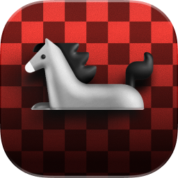
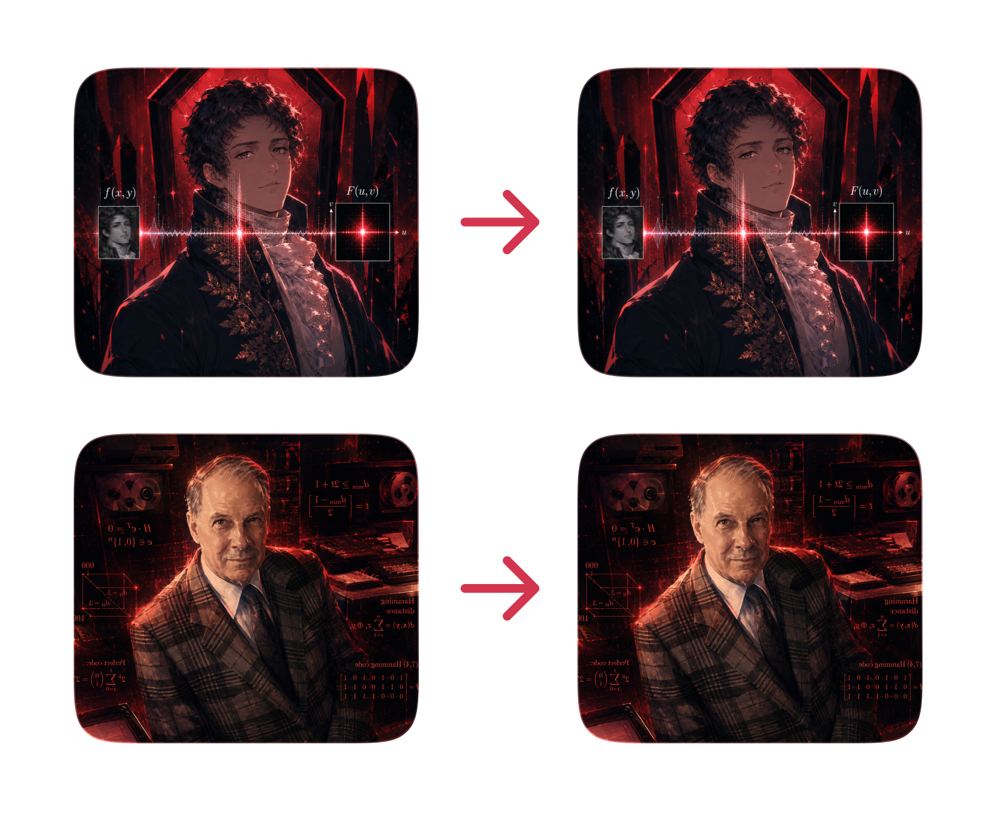
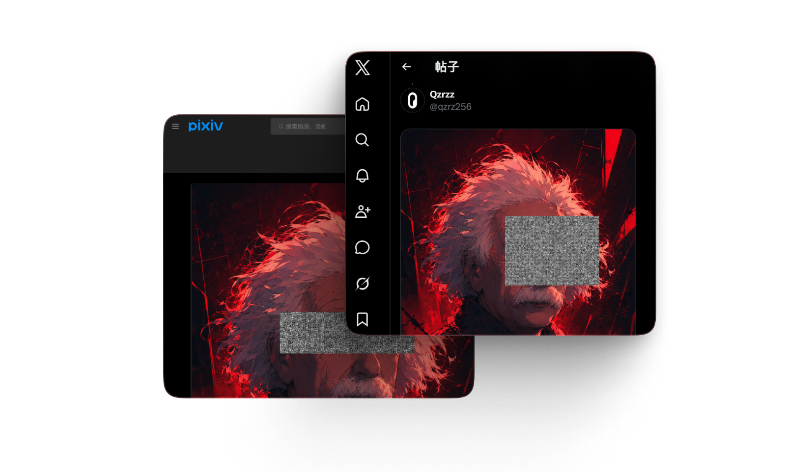

<div align="center">
  
  <h1>Q_____c</h1>
  <p><strong>科学马赛克——可逆的图片隐私打码方案</strong></p>
  <p>
    <a href="https://qzrzz.github.io/Q_____c/">在线使用</a> ·
    <a href="https://github.com/qzrzz/Q_____c/releases/latest">下载扩展</a> ·
    <a href="#本地开发">本地开发</a> ·
    <a href="#作为-typescript-库使用">TypeScript API</a>
  </p>
</div>

Q_____c 会将图片中选定的隐私区域转换为可再次恢复的频域图像。处理结果看起来像马赛克，同时保留恢复原图所需的信息；适合需要“公开时隐藏、必要时恢复”的图片工作流。

> [!IMPORTANT]
> Q_____c 是**可逆打码**，不是永久匿名化工具。任何能够获得正确密码或兼容解码器的人都有可能恢复内容。对于身份证件、密钥等高风险信息，请直接裁剪或使用不可逆覆盖。



## 功能特点

- **局部可逆打码**：在图片上框选一个或多个区域，仅转换选中内容。
- **自动识别与恢复**：解码模式可检测图片中的 Q_____c 频域区域。
- **密码保护**：推荐的 v8 算法支持使用密码控制编码与恢复。
- **适应二次处理**：针对常见的图片缩放与 JPEG 再编码提供一定恢复能力。
- **结果即时预览**：可预览原始、缩放、JPEG 以及 720p JPEG 场景下的恢复效果。
- **本地处理**：Web 编辑器在浏览器内完成图像计算，无需上传原图。
- **跨平台**：提供 Web 编辑器、浏览器扩展以及 TypeScript 核心库。
- **免费开源**：项目以 MIT 许可证发布。

## 在线使用

打开 **[Q_____c 在线编辑器（GitHub Pages）](https://qzrzz.github.io/Q_____c/)**：

1. 导入需要处理的图片。
2. 在“编码”模式中框选需要隐藏的区域。
3. 选择算法；新图片建议使用默认的 **v8**。
4. 根据需要设置密码，并妥善保存密码。
5. 检查恢复预览，然后导出处理后的图片。

恢复图片时，切换到“解码”模式，导入图片并输入编码时使用的密码。编辑器会自动寻找可恢复区域，也可以手动调整选区。

> [!TIP]
> 社交平台通常会压缩或缩小图片。建议先把原图缩放到平台允许的尺寸，再进行编码；尽量使用 PNG，或选择较高 JPEG 质量，以获得更好的恢复效果。

## 浏览器扩展

扩展可以识别网页图片中的 Q_____c 马赛克，并在本地恢复内容。

### 从 GitHub Releases 安装

1. 打开 **[最新版本发布页](https://github.com/qzrzz/Q_____c/releases/latest)**。
2. 在 Assets 中下载浏览器扩展压缩包并解压。
3. 打开 Chromium 浏览器的扩展管理页面并启用“开发者模式”。
4. 选择“加载已解压的扩展程序”，载入刚才解压的扩展目录。

升级时，请从 [Releases](https://github.com/qzrzz/Q_____c/releases) 下载新版扩展，并重新加载。

### 从源码构建

开发或测试最新代码时，也可以自行构建：

```bash
git clone https://github.com/qzrzz/Q_____c.git
cd Q_____c
bun install
bun run extension:build
```

构建产物位于 `extension/dist`，可通过浏览器的“加载已解压的扩展程序”载入。

扩展需要读取网页图片，因此清单中包含所有网站的访问权限。恢复操作与设置保存在本地，不会由本项目上传至服务器。

## 作为 TypeScript 库使用

核心 API 接受类似浏览器 `ImageData` 的 RGBA 数据：

```bash
bun add github:qzrzz/Q_____c
```

```ts
interface ImageDataLike {
    width: number
    height: number
    data: Uint8Array | Uint8ClampedArray
}
```

推荐使用 v8 编码器。它支持密码保护，并针对缩放及有损转码后的载体提供恢复逻辑：

```ts
import {
    fd2image_by_fft_v8,
    image2fd_by_fft_v8,
    type ImageDataLike,
} from "q_____c"

const source: ImageDataLike = canvasContext.getImageData(0, 0, width, height)
const password = "请换成你的密码"

// 将原始区域转换为频域载体。
const encoded = await image2fd_by_fft_v8(source, password)

// 使用相同密码恢复图像。
const restored = await fd2image_by_fft_v8(encoded, password)
```

从一张完整图片中识别 Q_____c 区域：

```ts
import { getImageQcRects } from "q_____c"

const rects = getImageQcRects(imageData)
// [{ x, y, width, height, confidence }, ...]
```

仓库目前仍处于早期开发阶段，包名、算法和 API 可能变化。`v2` 至 `v7` 保留用于兼容与实验；创建新内容时建议使用 v8，并让编码端与解码端采用相同版本。

## 工作原理

传统马赛克会丢弃原始像素，而 Q_____c 将选区转换成可保存为普通像素图片的频域载体。恢复时，解码器读取载体并执行逆变换，重建原始区域。

v8 使用局部 DHT 分层载体：基础层优先保存低频亮度与色差信息，增强层补充更多频谱细节；密码参与载体单元的排列与白化。缩放或 JPEG 编码会损失部分高频信息，因此恢复结果可能出现模糊、色差或细节缺失，且处理越强，损失通常越明显。



## 本地开发

### 环境要求

- [Bun](https://bun.sh/) 最新稳定版
- 支持 Web Crypto 的现代浏览器

### 安装与运行

```bash
git clone https://github.com/qzrzz/Q_____c.git
cd Q_____c
bun install
bun run editor:dev
```

Vite 会输出本地编辑器地址。常用命令如下：

| 命令 | 说明 |
| --- | --- |
| `bun run editor:dev` | 启动 Web 编辑器开发服务器 |
| `bun run editor:build` | 构建 Web 编辑器到 `docs` |
| `bun run extension:build` | 构建浏览器扩展到 `extension/dist` |
| `bun run dev` | 监听并构建 TypeScript 核心库 |
| `bun run build` | 构建核心库到 `dist` |
| `bun run build:bundler` | 构建包含依赖的版本到 `bundle` |
| `bun run test` | 使用 Vitest 运行测试 |

## 项目结构

```text
.
├── src/        # 频域算法、识别工具与 TypeScript 导出
├── editor/     # Vue Web 编辑器
├── extension/  # Manifest V3 浏览器扩展
├── web/        # 项目介绍页源码与图片资源
├── docs/       # GitHub Pages / Web 编辑器构建产物
├── sample/     # 算法测试样图
├── test/       # 全局测试与基准测试入口
└── build/      # 核心库、网页和扩展的构建脚本
```

## 参与贡献

欢迎提交 Issue 和 Pull Request。修改算法时，请同时补充或更新附近的 Vitest 测试，并重点检查：

- PNG 编码后的正常恢复效果；
- 频域载体缩放后的恢复质量；
- JPEG 再编码后的恢复质量；
- 不同尺寸、透明通道和边缘块的行为。

算法目录内包含基准测试工具，可通过 PSNR、SSIM、MSE 与 MAE 对不同实现进行比较。

## 已知限制

- 可逆马赛克不能替代真正的删除、裁剪或不可逆脱敏。
- 图片缩放、裁剪、截图、滤镜和有损压缩均可能降低恢复质量，严重处理可能导致无法恢复。
- 密码错误不会得到原始内容；项目不负责保存或找回密码。
- 自动识别基于频域区域的视觉特征，复杂图片中可能出现漏检或误检。
- 当前浏览器扩展需要 Chromium Manifest V3 兼容环境。

## 许可证

[MIT](https://opensource.org/license/mit/)

 
